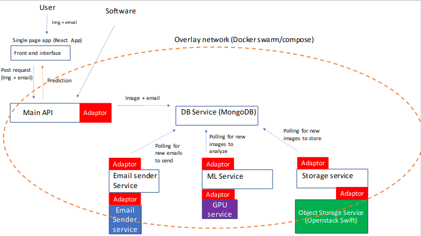

# EikonApp 
## Introduzione
EikonApp è una web app per l'analisi di immagini tramite algoritmi di machine learning con un'architettura orientata ai microservizi pensata e progettata per supportare utenze elevate tramite l'utilizzo di tecnologie di cloud computing e in stile il più possibile DevOps. La progettazione e lo sviluppo dell'app rappresentano il progetto di fine corso dell'esame di Computing technologies (Laurea magistrale in Fisica con curriculum Particle Astroparticle Physics and Advanced Technologies UniBa). In particolare per il deployment sono state utilizzare risorse di ReCas nella forma di Infrastracture as a Service. 

Lo schema implementativo dell'applicazione è mostrato di seguito: 
 

L'idea è che l'utente possa caricare immagini dal front end (o direttamente dall'api) e ricevere il risultato dell'analisi in tempo reale tramite una query dello stato di processamento. Nel caso in cui l'analisi richieda un tempo eccessivo o il servizio di ML sia irragiungibile, l'utente può lasciare un indirizzo mail e il risultato verrà inviato automaticamente alla conclusione del processamento. I file, insieme ai meta dati e alle informazioni sullo stato di processamento vengono salvate nel database. I servizi di Machine Learning e Object Storage faranno polling continuo sul database in cerca di file successivi da analizzare e salvare. Lo storage persistente è stato aggiunto in ottica di retraining periodico del classificatore. Per evitare colli di bottiglia, dopo il salvataggio in cloud di un'immagine il servizio di object storage procede all'eliminazione del file binario nel database (ma non dei metadati). 
I vari servizi comunicano tra loro tramite l'overlay network messo a disposizione da docker-compose anche se si prevede la necessità di migrare a servizi più sofisticati come docker-swarm per una maggiore granularità dei servizi e maggiore resilienza (per maggiori informazioni vedi **Dockerizzazione**)
Tutti i servizi vengono disaccoppiati il più possibile dalla tecnologia di cloud tramite adattatori software. 

## Analisi codice
Guardiamo brevemente la composizione delle diverse parti del codice dell'app. 
* ### Front end 

## Dockerizzazione
## Workflow di developement sull'app 
## Cose da migliorare

# images_classifier
Progetto di computing technologies

Per ogni servizio c'è un Dockerfile che builda l'immagine per il commit. Ogni volta che viene effettuata una modifica o un aggiornamento
su uno dei servizi, è necessario ribuildare l'immagine usando il dockerfile. (In particolare si può usare lo script rebuild.sh)
$ sudo ./rebuild.sh NOMEIMMAGINE

Le immagini buildate sono disponibili sul dockerhub akumuyuma e sono:
    akumuyuma/front_end
    akumuyuma/backend
    akumuyuma/mlservice
    akumuyuma/osservice
È stata anche utilizzata un'immagine base mongo per il database.

# Nota per immagine front_end
Per l'immagine del front_end è stata usata una multistage build. Questo vuol dire che quando buildi vengono prodotte due immagini,
una con node e una con nginx. Quella con node installa le dipendenze e builda il progetto, quella con nginx fa il deployment.
Quella che viene caricata su dockerhub però è solo quella di nginx. Questa è molto più compatta e contiene solo la build.

Nella cartella è anche presente un docker-compose.yml. Questo permette di costruire l'intero servizio. Fa partire tutti i servizi contemporaneamente
e produce un overlay network per permettere ai diversi servizi di comunicare utilizzando il loro nome (quello definito in docker-compose.yml).
In realtà la necessità è che ogni servizio possa accedere al servizio di database. In questo caso l'accesso verrà effettuato usando l'URI:
"mongodb://db:27017".
Nel source code al posto di db c'è localhost, dato che nella fase di developement abbiamo eseguito tutti i processi non dockerizzati.
Per lo stesso motivo all'interno di tutti i Dockerfile c'è la linea "RUN sed -i 's/localhost/db/' ./NOMESCRIPT". In questo modo, il cambiamento del nome
è stato effettuato solamente all'interno dell'immagine.

Per far partire l'intero servizio è quindi possibile usare docker-compose up (c'è lo script start_app.sh che fa questo) e per stoppare stop_app.sh.

In questo modo ogni parte del processo è stata automatizzata, in ottica devOps.

Ricapitolando, il workflow è:
    Modifica di una parte di codice
    run dello script per il rebuild dell'immagine
    run dello script per il restart dell'applicazione
    upload dell'immagine modificata su dockerhub
    upload del nuovo codice su github

Con questo procedimento è anche possibile aggiungere un ulteriore servizio in maniera trasparente. Basterà produrre un'immagine, modificare il file docker-compose
e restartare l'app.

# TODOS
L'app comunque necessita ancora modifiche a livello di codice. In particolare è necessario:
- Debug al servizio di object storage. (Non sono sicuro che si riescano a leggere le immagini salvate) Aggiungere risultato classificazione all'oggetto permanente
- Aggiungere parte effettiva di machine learning, in questo momento va solo una simulazione che classifica randomicamente
- Refactoring al codice, in particolare:
-   Utilizzo di un database adaptor per parti di ML e OS
-   Utilizzo di variabili di ambiente per evitare hardcoding di dati e url
- Aggiungere un load balancer all'inizio dell'api
