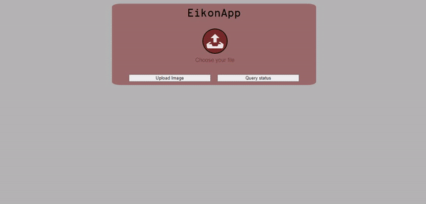

#  EikonApp 
## Introduzione
EikonApp è una web app per l'analisi di immagini tramite algoritmi di machine learning con un'architettura orientata ai microservizi pensata e progettata per supportare utenze elevate tramite l'utilizzo di tecnologie di cloud computing e in stile il più possibile DevOps. La progettazione e lo sviluppo dell'app rappresentano il progetto di fine corso dell'esame di Computing technologies (Laurea magistrale in Fisica con curriculum Particle Astroparticle Physics and Advanced Technologies UniBa). In particolare per il deployment sono state utilizzare risorse di ReCas nella forma di Infrastracture as a Service. 

Lo schema implementativo dell'applicazione è mostrato di seguito: 
 

L'idea è che l'utente possa caricare immagini dal front end (o direttamente dall'api) e ricevere il risultato dell'analisi in tempo reale tramite una query dello stato di processamento. Nel caso in cui l'analisi richieda un tempo eccessivo o il servizio di ML sia irragiungibile, l'utente può lasciare un indirizzo mail e il risultato verrà inviato automaticamente alla conclusione del processamento. I file, insieme ai meta dati e alle informazioni sullo stato di processamento vengono salvate nel database. I servizi di Machine Learning e Object Storage faranno polling continuo sul database in cerca di file successivi da analizzare e salvare. Lo storage persistente è stato aggiunto in ottica di retraining periodico del classificatore. Per evitare colli di bottiglia, dopo il salvataggio in cloud di un'immagine il servizio di object storage procede all'eliminazione del file binario nel database (ma non dei metadati). 
I vari servizi comunicano tra loro tramite l'overlay network messo a disposizione da docker-compose. Si prevede la necessità di migrare a servizi più sofisticati come docker-swarm per una maggiore granularità dei servizi e resilienza (per maggiori informazioni vedi **Dockerizzazione**)
Tutti i servizi vengono disaccoppiati il più possibile dalla tecnologia di cloud tramite adattatori software. 

Attualmente la parte di front end è servita all'indirizzo http://90.147.170.229, mentre l'api è servita su http://90.147.170.229:443. Di seguito una demo sul funzionamento attuale. 
 

## Analisi codice
Guardiamo brevemente la composizione delle diverse parti del codice dell'app. 
### Front end 
Questa parte rappresenta un'interfaccia comoda per l'utilizzo del servizio. Si tratta di una applicazione a singola pagina renderizzata dinamicamente tramite l'uso di React.js. 
La funzione triggerata dal tasto Upload Image è il seguente: 
```javascript
const handleSubmit = () => {

        if (selectedFile != null) {
            setFileId(0);
            setStatus(null);
            const fd = new FormData();
            fd.append(props.name, selectedFile);
            axios.post(apiPaths.baseUploadUrl + props.name, fd)
                .then(res => {
                    setFileId(res.data.id);
                })
                .catch(err => {
                    console.log(err);
                });
        }
    }
```
Viene creato un FormData che contiene il file da caricare sul database e viene fatta una richiesta POST all'API. La risposta del server (id con cui il nuovo file viene salvato nel databas) viene salvata nella variabile di stato FileId. 

Alla query dello stato, invece, viene triggerata la funzione: 
```javascript
    const queryStatus = () => {
        // Gestione per richiesta dello stato di processamento
        if (fileId != null) {
            axios.get(apiPaths.baseQueryUrl + fileId)
                .then(res => {
                    setStatus(res.data);
                })
        }
    }
```
In questo caso, invece, viene fatta una richiesta get all'API chiedendo lo stato di processamento e salvataggio del file. Anche in questo caso viene utilizzata una variabile di stato per aggiornare il testo da renderizzare a schermo.

### Back end
Questa parte è stata sviluppata in python tramite l'utilizzo di Flask. Il servizio di API salva file sul database (e restituisce l'id univoco sul db) e ne chiede lo stato di processamento. 
```python
@app.route('/api/upload/input=<inputFile>', methods=["POST"])
def upload(inputFile):
    """
        Path per l'upload di un file mandato tramite richiesta POST.
        Il file viene salvato nel database Mongo.
        :param: immagine
        :return: json con id del file caricato
    """
    file = request.files[inputFile]
    if not file:
        abort(
            404,
            description="No file Selected"
        )
    fileId = database.save_image(file.filename, file, processed=False, permaSaved=False, classification=None)
    return jsonify({"id": str(fileId)})
```
Si noti che l'interfaccia con il database viene gestita tramite un adattatore.

```python 
@app.route('/api/get_state/id=<file_Id>')
def get_state(file_Id):
    """
        :param: fileId -> Id del file da controllare.
        :return: json con stato dell'oggetto, 404 se file inesistente
    """
    file_Id = database.type_conversion(file_Id)
    file_obj = database.find_one({"_id": file_Id})
    if not file_obj:
        abort(
            404,
            description="Invalid id"
        )
    res = {
        "processed": file_obj["processed"],
        "permaSaved": file_obj["permaSaved"],
        "classification": file_obj["classification"]
    }
    return jsonify(res)
```
### Machine Learning e Object storage 
Attualmente la parte di Machine learning è solamente simulata. La parte interessante condivisa da entrambi i servizi è il modo di accedere al database.
```python
identificativo = random.uniform(0, 1000)
db.fs.files.update_one({"processed": True, "permaSaved": False}, {
                               "$set": {"processing": identificativo}})
        # Prendo il file facendo la query
        element = db.fs.files.find_one({"processing": identificativo})
        # Se c'è almeno un file
        if element is not None:
            #
            #
            # Cose da fare con l'oggetto
            #
            #
            db.fs.files.update_one({"processing": identificativo}, {
                                  "$set": {"permaSaved": True}, "$unset": {"processing": 1}})
```
Potrebbero esserci diversi servizi o diverse istanze di un servizi a fare la query ad un file da analizzare o da salvare ed è necessario garantire l'atomicità del processo. Per fare questo, il primo file trovato viene immediatamente flaggato come in processamento tramide un id univoco (generato randomicamente). Successivamente le operazioni vengono effettuate sull'oggetto in processamento.

Una nota sulla parte di Object Storage. Il daemon si aspetta di leggere url e token di autenticazione in due file presenti nella cartella /root. 
Questa comunque può risultare una vulnerabilità e sarebbe necessario trovare una soluzione più sicura. 

## Dockerizzazione
Ogni servizio è stato isolato all'interno di un container. In particolare sono state buildate immagini Docker che contengono l'intero servizio, dunque per mettere in produzione l'app basta pullare le immagini e comporle con un orchestratore. 
Attualmente le immagini sono disponibili all'indirizzo https://hub.docker.com/u/akumuyuma. 
In particolare le immagini sono: 
-   akumuyuma/front_end
-   akumuyuma/backend
-   akumuyuma/mlservice
-   akumuyuma/osservice

Ovviamente a questo si aggiunge l'immagine **mongo** utilizzata "as is" in quanto non richiedeva alcuna personalizzazione. 
Vediamo un esempio di build delle immagini. Il seguente è il Dockerfile per il front end.
```Dockerfile
FROM node:latest AS build
WORKDIR /app
COPY package*.json ./
RUN npm install --production
COPY . .
RUN npm run build


FROM nginx:latest
WORKDIR /app
COPY ./nginx/default.conf /etc/nginx/conf.d/default.conf
COPY --from=build /app/build .
```
In particolare questa è una multi stage build: quando viene buildata, vengono create due immagini, una a partire da node che installa le dipendenze e builda il frontend, la seconda a partire da nginx, che contiene solo l'app già buildata e la serve sulla porta 80. L'immagine *akumuyuma/front_end* caricata su dockerhub contiene solo la seconda immagine (quella a partire da nginx) più leggera e portabile. 
Si noti in (quasi) tutti i Dockerfile, la presenza della riga `RUN sed -i 's/localhost/NUOVO_NOME/' ./NOME_FILE`, necessaria a cambiare solamente all'interno dell'immagine, l'indirizzo a cui vengono fatte le richieste, da localhost (utilizzato nella fase di developement) al nome del servizio specificato nel file docker-compose. 
Ad esempio, per l'accesso al database, anzichè fare la richiesta a `mongodb://localhost:27017` è necessario fare la richiesta a `mongodb://db:27017`, questa sostituzione viene fatta nel build context dell'immagine (ed in particolare aggiunge un layer). 

### Composizione dei docker
I diversi servizi sono stati poi orchestrati utilizzando docker compose. 
``` yml
version: "3.7"
services:
  front_end:
    image: akumuyuma/front_end:1.2
    ports:
      - 80:80
  backend:
    image: akumuyuma/backend:1.2
    ports:
      - 443:443

  db:
    image: mongo:latest
    volumes:
      - /data/progetto/mongoDB/database:/data/db
    ports:
      - 27017:27017

  mlservice:
    image: akumuyuma/mlservice:1.0

  osservice:
    image: akumuyuma/osservice:1.0
    volumes:
      - /root:/root
```
Tramite il comando `docker-compose up` è possibile far partire l'intera app. La necessità di avere un docker-compose non è solo determinata dalla necessità di automatizzare l'avvio e l'arresto dell'insieme di servizi, ma anche dalla possibilià di avere un overlay network (virtuale) tra i docker per permettere la comunicazione reciproca. È più chiaro adesso il motivo per cui l'uri del database diventa `mongodb://db:27017`, questo è determinato dalla scelta del nome del servizio. 

Si noti inoltre che, grazie scelta di inserire il codice all'interno delle immagini in fase di build, non è necessario quasi mai montare parti del filesystem host nelle macchine virtuali. Eccezione è il servizio di Object Storage che, come detto prima necessita l'accesso ai file nella cartella /root. Questo costituirebbe una vulnerabilità se per qualche motivo l'isolamento del docker dovesse venire meno. Inoltre questa scelta riduce la portabilità del servizio che attualmente necessita l'esecuzione su questa particolare macchina. Una soluzione potrebbe essere quella di fare richiesta direttamente a swift per il refresh del token invece di leggerlo dal filesystem. 

## Workflow di developement sull'app 
## Cose da migliorare


# images_classifier
Progetto di computing technologies


Per ogni servizio c'è un Dockerfile che builda l'immagine per il commit. Ogni volta che viene effettuata una modifica o un aggiornamento
su uno dei servizi, è necessario ribuildare l'immagine usando il dockerfile. (In particolare si può usare lo script rebuild.sh)
$ sudo ./rebuild.sh NOMEIMMAGINE

Le immagini buildate sono disponibili sul dockerhub akumuyuma e sono:
    akumuyuma/front_end
    akumuyuma/backend
    akumuyuma/mlservice
    akumuyuma/osservice
È stata anche utilizzata un'immagine base mongo per il database.

# Nota per immagine front_end
Per l'immagine del front_end è stata usata una multistage build. Questo vuol dire che quando buildi vengono prodotte due immagini,
una con node e una con nginx. Quella con node installa le dipendenze e builda il progetto, quella con nginx fa il deployment.
Quella che viene caricata su dockerhub però è solo quella di nginx. Questa è molto più compatta e contiene solo la build.

Nella cartella è anche presente un docker-compose.yml. Questo permette di costruire l'intero servizio. Fa partire tutti i servizi contemporaneamente
e produce un overlay network per permettere ai diversi servizi di comunicare utilizzando il loro nome (quello definito in docker-compose.yml).
In realtà la necessità è che ogni servizio possa accedere al servizio di database. In questo caso l'accesso verrà effettuato usando l'URI:
"mongodb://db:27017".
Nel source code al posto di db c'è localhost, dato che nella fase di developement abbiamo eseguito tutti i processi non dockerizzati.
Per lo stesso motivo all'interno di tutti i Dockerfile c'è la linea "RUN sed -i 's/localhost/db/' ./NOMESCRIPT". In questo modo, il cambiamento del nome
è stato effettuato solamente all'interno dell'immagine.

Per far partire l'intero servizio è quindi possibile usare docker-compose up (c'è lo script start_app.sh che fa questo) e per stoppare stop_app.sh.

In questo modo ogni parte del processo è stata automatizzata, in ottica devOps.

Ricapitolando, il workflow è:
    Modifica di una parte di codice
    run dello script per il rebuild dell'immagine
    run dello script per il restart dell'applicazione
    upload dell'immagine modificata su dockerhub
    upload del nuovo codice su github

Con questo procedimento è anche possibile aggiungere un ulteriore servizio in maniera trasparente. Basterà produrre un'immagine, modificare il file docker-compose
e restartare l'app.


# TODOS
L'app comunque necessita ancora modifiche a livello di codice. In particolare è necessario:
- Debug al servizio di object storage. (Non sono sicuro che si riescano a leggere le immagini salvate) Aggiungere risultato classificazione all'oggetto permanente
- Aggiungere parte effettiva di machine learning, in questo momento va solo una simulazione che classifica randomicamente
- Refactoring al codice, in particolare:
-   Utilizzo di un database adaptor per parti di ML e OS
-   Utilizzo di variabili di ambiente per evitare hardcoding di dati e url
- Aggiungere un load balancer all'inizio dell'api
